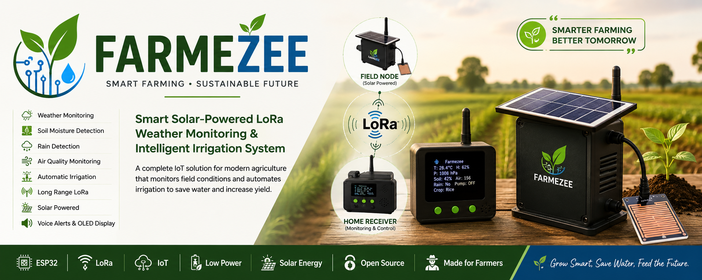
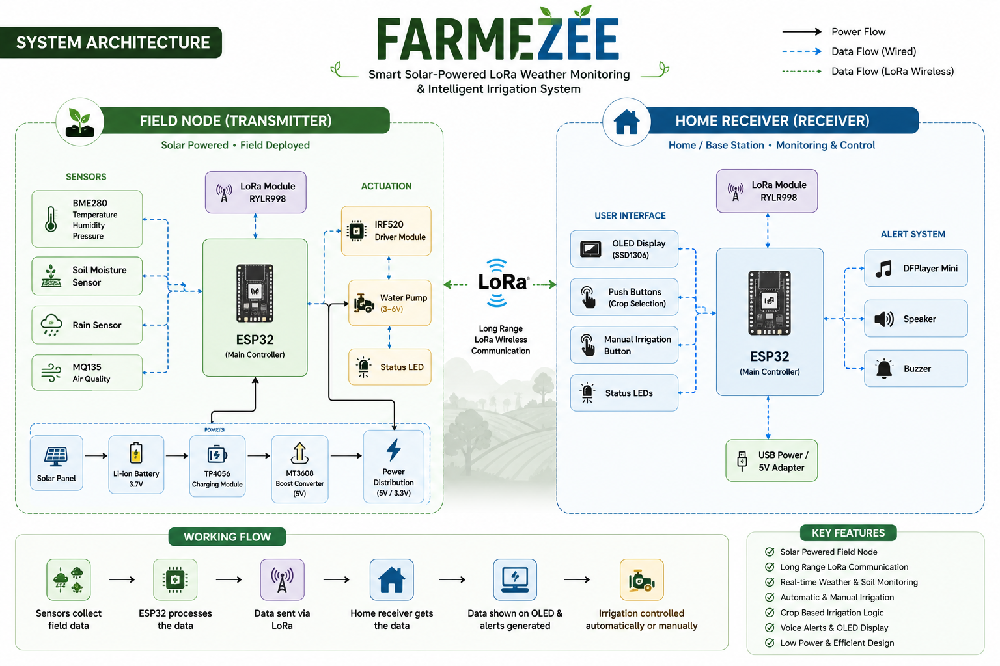
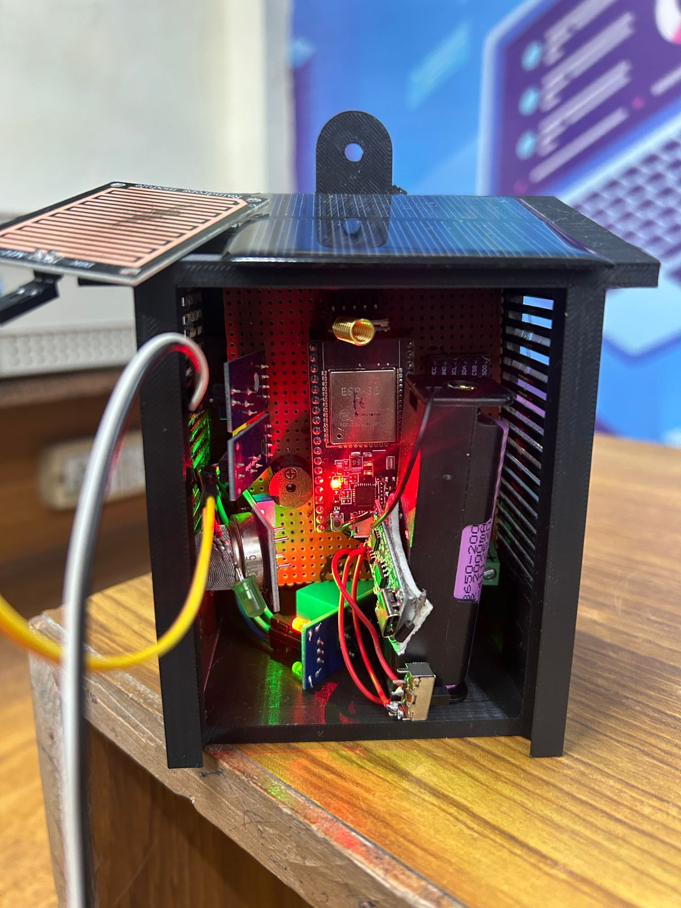
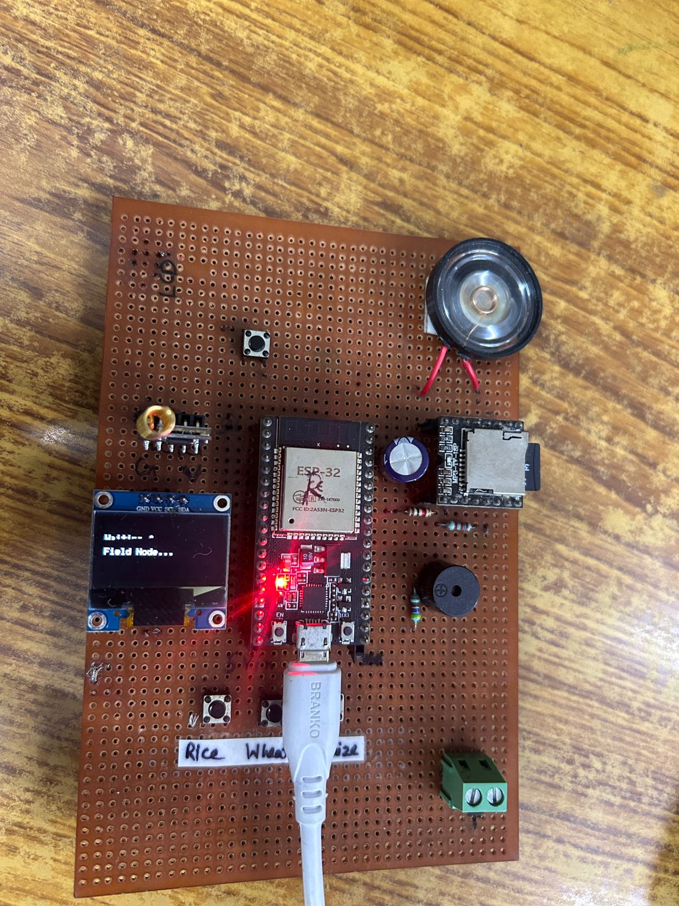

# 🌱 Farmezee

  

---

# Smart Solar-Powered LoRa Weather Monitoring & Intelligent Irrigation System

**Farmezee** is a compact IoT-based precision agriculture system that combines long-range LoRa communication, weather monitoring, and intelligent irrigation into a single solution.

The project consists of two independent ESP32-based devices:

* 🌾 **Field Node** – Installed in the farm to monitor environmental conditions and control irrigation.
* 🏠 **Home Receiver** – Installed at the farmer's home for real-time monitoring, crop selection, manual irrigation, and voice alerts.

Unlike conventional IoT irrigation systems that depend on Wi-Fi or cellular networks, Farmezee uses **LoRa technology** for reliable long-distance communication with extremely low power consumption, making it suitable for remote agricultural fields.

---

# ✨ Features

* 🌞 Solar Powered Field Node
* 📡 Long-Range LoRa Communication
* 🌡 Temperature Monitoring
* 💧 Humidity Monitoring
* 🌱 Soil Moisture Detection
* 🌧 Rain Detection
* 🌬 Air Quality Monitoring
* 🚰 Automatic Irrigation
* 🎛 Manual Irrigation
* 🌾 Crop-Based Irrigation Logic
* 🔊 Voice Alerts
* 📺 OLED Display
* 🔋 Battery Powered
* ⚡ Low Power Design
* ☁️ Cloud Monitoring (Blynk IoT)
* 📱 Remote Dashboard
* 📊 Live Sensor Visualization

---

# 🏗 System Architecture

The system is divided into two intelligent nodes connected using LoRa wireless communication.

### 🌾 Field Node

The Field Node continuously monitors environmental conditions using multiple sensors. The ESP32 processes the sensor data and decides whether irrigation is required based on the selected crop profile. The processed data is then transmitted to the Home Receiver through LoRa.

### 🏠 Home Receiver

The Home Receiver displays live sensor readings on an OLED display, allows crop selection, supports manual irrigation, and provides audio alerts using a DFPlayer Mini and speaker.

---

# 📸 Project Gallery

## Field Node

**Features**

* Solar Powered
* 3D Printed Enclosure
* Weather Monitoring
* Automatic Irrigation
* Integrated Pump
* Long Range LoRa Communication

---

## Home Receiver

**Features**

* Compact Portable Design
* OLED Display
* LoRa Receiver
* Voice Alerts
* Crop Selection
* Manual Irrigation
  

---

# ⚙ Hardware Components

## Field Node

| Component            | Purpose                          |
| -------------------- | -------------------------------- |
| ESP32                | Main Controller                  |
| RYLR998 LoRa Module  | Wireless Communication           |
| BME280               | Temperature, Humidity & Pressure |
| Soil Moisture Sensor | Soil Monitoring                  |
| Rain Sensor          | Rain Detection                   |
| MQ135                | Air Quality Monitoring           |
| IRF520 Driver        | Pump Driver                      |
| Water Pump           | Irrigation                       |
| Solar Panel          | Power Generation                 |
| Li-ion Battery       | Backup Power                     |
| TP4056               | Battery Charging                 |
| MT3608               | Boost Converter                  |

---

## Home Receiver

| Component           | Purpose                |
| ------------------- | ---------------------- |
| ESP32               | Main Controller        |
| OLED Display        | User Interface         |
| RYLR998 LoRa Module | Wireless Communication |
| DFPlayer Mini       | Voice Alerts           |
| Speaker             | Audio Output           |
| Push Buttons        | Crop Selection         |
| Manual Button       | Pump Control           |
| Buzzer              | Alert System           |

---

# 🔄 Working Principle

1. The Field Node continuously measures environmental conditions.

2. The ESP32 processes sensor readings.

3. Data is transmitted through LoRa.

4. The Home Receiver receives live data.

5. Sensor values are displayed on the OLED display.

6. Audio alerts notify the farmer about important events.

7. Irrigation is controlled automatically or manually.

---
                    FARMEZEE

                 ┌─────────────┐
                 │ Field Node  │
                 │ ESP32       │
                 └──────┬──────┘
                        │
         ┌──────────────┴──────────────┐
         │                             │
      LoRa                         Wi-Fi
         │                             │
         ▼                             ▼
     Home Receiver                 Blynk Cloud
     (OLED)                            │
                                       ▼
                             Mobile App / Dashboard
                         

---
# ☁️ Cloud Integration

Farmezee also supports cloud-based monitoring using the **Blynk IoT Platform**.

The ESP32 uploads environmental data to the Blynk Cloud, enabling users to monitor field conditions remotely through a web dashboard or mobile application.

### Dashboard Features

- Live Temperature
- Humidity
- Barometric Pressure
- Soil Moisture
- Rain Detection
- Pump Status
- Alarm Status
- Remote Monitoring

# 🚀 Future Improvements

* PCB Version
* Mobile Application
* MQTT Integration
* OTA Firmware Updates
* AI-Based Irrigation Prediction
* Weather Forecast Integration
* IP65 Waterproof Enclosure

---

# 👨‍💻 Author

**Mohammad Sharique Arsahad**

Electronics & Communication Engineering

Focused on Embedded Systems, IoT, PCB Design and Intelligent Automation.

---

# 📜 License

This project is licensed under the MIT License.
