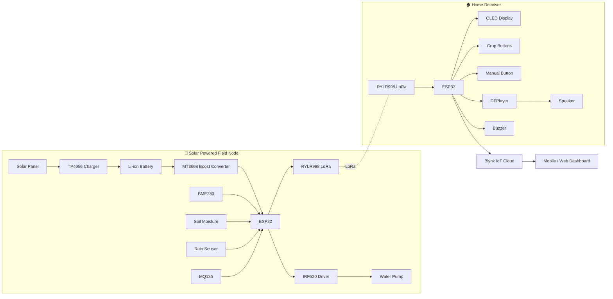

# System Architecture

```mermaid
flowchart LR

subgraph Field_Node["🌾 Solar Powered Field Node"]
SP[Solar Panel]
TP[TP4056 Charger]
BAT[Li-ion Battery]
MT[MT3608 Boost Converter]
ESP1[ESP32]

BME[BME280]
SOIL[Soil Moisture]
RAIN[Rain Sensor]
MQ[MQ135]

LORA1[RYLR998 LoRa]

PUMP[Water Pump]
IRF[IRF520 Driver]

SP --> TP --> BAT --> MT --> ESP1

BME --> ESP1
SOIL --> ESP1
RAIN --> ESP1
MQ --> ESP1

ESP1 --> IRF --> PUMP
ESP1 --> LORA1
end

LORA1 -. LoRa .- LORA2

subgraph Receiver["🏠 Home Receiver"]
LORA2[RYLR998 LoRa]
ESP2[ESP32]

OLED[OLED Display]
BTN[Crop Buttons]
MANUAL[Manual Button]

DF[DFPlayer]
SPK[Speaker]
BUZ[Buzzer]

LORA2 --> ESP2

ESP2 --> OLED
ESP2 --> BTN
ESP2 --> MANUAL

ESP2 --> DF
DF --> SPK
ESP2 --> BUZ
end

ESP2 --> CLOUD[Blynk IoT Cloud]
CLOUD --> APP[Mobile / Web Dashboard]
```
